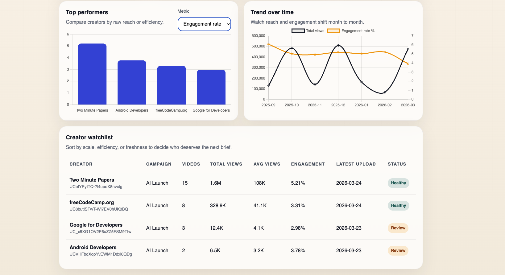
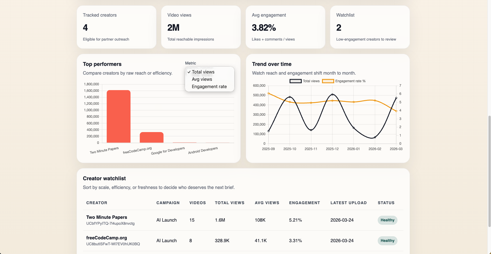

# HardScope Creator Campaign Analytics

A lightweight creator campaign analytics application built for brand partnerships teams. It ingests real YouTube performance data, stores it in a normalized SQLite schema, exposes a REST API for filtering and aggregation, and presents the results in a React dashboard focused on reach, engagement, and creator health.

## What I built

- Real data ingestion from the YouTube Data API v3
- A Flask + SQLite backend designed around creator-level rollups and trend analytics
- A React dashboard with summary stats, sortable creator table, and charts
- A small recurring refresh script for scheduled ingestion
- Automated backend tests for schema creation, ingestion, and analytics behavior

## Dashboard preview

### Full dashboard



### Analytics section



## Live verification

I verified the ingest flow locally on March 24, 2026 with a real YouTube Data API key.

Confirmed live dataset in the local dashboard:

- Creators tracked: `4`
- Campaign label: `AI Launch`
- Total views stored: `1,967,503`
- Average engagement rate shown in the dashboard: `3.82%`
- Watchlist creators flagged: `2`
- Top creator by total reach: `Two Minute Papers` with `1,620,036` views and `5.21%` engagement

Creators verified in the local dataset:

- `Two Minute Papers` — `15` videos, `1,620,036` total views
- `freeCodeCamp.org` — `8` videos, `328,632` total views
- `Google for Developers` — `3` videos, `12,395` total views
- `Android Developers` — `2` videos, `6,440` total views

## Why this source

I chose the YouTube Data API because it is a legitimate public source with stable video-level performance metrics that map cleanly to campaign analysis:

- `search.list` returns recent uploads for a creator channel
- `videos.list` returns the performance fields that matter for sponsorship decisions: views, likes, comments, publish date

Source documentation:

- https://developers.google.com/youtube/v3/docs/search/list
- https://developers.google.com/youtube/v3/docs/videos/list

## Quick start

### 1. Backend

```bash
cd backend
python3 -m venv .venv
source .venv/bin/activate
pip install -r requirements.txt
export YT_API_KEY=your_youtube_data_api_key
python3 app.py
```

The API will start on `http://localhost:8000`.

### 2. Ingest real creator data

In a second terminal:

```bash
curl -X POST http://localhost:8000/ingest \
  -H "Content-Type: application/json" \
  -d '{
    "platform": "youtube",
    "channel_id": "UC_x5XG1OV2P6uZZ5FSM9Ttw",
    "campaign_label": "AI Launch",
    "max_results": 15
  }'
```

Repeat that for any additional YouTube channel IDs you want to compare.

Recommended demo set for a polished dashboard:

- `UC_x5XG1OV2P6uZZ5FSM9Ttw` — Google for Developers
- `UCBJycsmduvYEL83R_U4JriQ` — Marques Brownlee
- `UCsBjURrPoezykLs9EqgamOA` — Linus Tech Tips
- `UC8butISFwT-Wl7EV0hUK0BQ` — freeCodeCamp.org

Why this set:

- all are recognizable technology creators or education brands
- they should produce different scales of reach and engagement
- they fit a believable brand-partnerships scenario around developer tools, AI, or consumer tech launches

Example batch:

```bash
curl -X POST http://localhost:8000/ingest \
  -H "Content-Type: application/json" \
  -d '{"platform":"youtube","channel_id":"UCBJycsmduvYEL83R_U4JriQ","campaign_label":"AI Launch","max_results":15}'

curl -X POST http://localhost:8000/ingest \
  -H "Content-Type: application/json" \
  -d '{"platform":"youtube","channel_id":"UCsBjURrPoezykLs9EqgamOA","campaign_label":"AI Launch","max_results":15}'

curl -X POST http://localhost:8000/ingest \
  -H "Content-Type: application/json" \
  -d '{"platform":"youtube","channel_id":"UC8butISFwT-Wl7EV0hUK0BQ","campaign_label":"AI Launch","max_results":15}'
```

Optional recurring refresh script:

```bash
cd backend
export YT_API_KEY=your_youtube_data_api_key
export YT_CHANNEL_IDS=UC_x5XG1OV2P6uZZ5FSM9Ttw,UCVHFbqXqoYvEWM1Ddxl0QDg
export YT_CAMPAIGN_LABEL=Spring_Push
python3 refresh_channels.py
```

That script is designed so it can be scheduled with `cron`, GitHub Actions, or any task runner.

This repo also includes a GitHub Actions workflow at `.github/workflows/refresh.yml` that can refresh creator data every 6 hours or be triggered manually with `workflow_dispatch`. It expects a repository secret named `YT_API_KEY`.

### 3. Frontend

```bash
cd frontend
npm install
npm run dev
```

The dashboard will run on `http://localhost:5173`.

If your backend is not on port `8000`, set:

```bash
export VITE_API_URL=http://localhost:8000
```

## REST API

### `POST /ingest`

Fetches recent videos for a YouTube channel and upserts them into SQLite.

Example payload:

```json
{
  "platform": "youtube",
  "channel_id": "UC_x5XG1OV2P6uZZ5FSM9Ttw",
  "campaign_label": "AI Launch",
  "max_results": 15
}
```

### `GET /creators`

Returns creator rollups with filters and sorting.

Supported query params:

- `platform`
- `start_date`
- `end_date`
- `min_views`
- `min_engagement`
- `sort_by`
- `sort_dir`
- `limit`

Example:

```bash
curl "http://localhost:8000/creators?platform=youtube&min_views=50000&sort_by=engagement_rate"
```

### `GET /analytics/overview`

Returns:

- overall summary stats
- platform-level metadata
- monthly trend data

### `GET /analytics/top`

Returns top creators ranked by:

- `total_views`
- `avg_views`
- `engagement_rate`

## Dashboard behavior

The dashboard is designed to help a partnerships lead decide who to brief next, not just browse rows:

- Summary cards answer scale and health questions quickly
- The top-performers chart can switch between raw reach and efficiency
- The trend chart shows whether engagement is improving or stalling over time
- The creator table surfaces campaign tags, upload freshness, and a simple watchlist flag

The watchlist flag is intentionally lightweight:

- creators with engagement below `1.5%` are flagged
- creators with average views below `25,000` are flagged

That is intentionally simple, but it demonstrates how the product can move from descriptive reporting toward operational alerting.

## Architecture decisions

### Backend

- **Flask**: quick to stand up, easy to read, and a good fit for a small API surface
- **SQLite**: enough structure for analytics without adding operational overhead
- **Normalized schema**: `creators` and `videos` keep raw facts separate from derived analytics
- **Upserts**: repeated ingests refresh metrics rather than duplicating records

### Frontend

- **React + Vite**: fast local iteration and minimal setup cost
- **Chart.js**: enough charting flexibility without overbuilding the frontend
- **Single dashboard view**: optimized for fast decision-making over navigation depth

## Data model

### `creators`

- `platform`
- `channel_id`
- `name`
- `source`
- `campaign_label`
- `last_ingested_at`

### `videos`

- `creator_id`
- `video_id`
- `title`
- `published_at`
- `views`
- `likes`
- `comments`
- `fetched_at`

This keeps raw video facts separate from creator aggregates so the API can support both detailed inspection and rolled-up reporting.

## Error handling and edge cases

- Retries and backoff for transient API failures and 429s in the scraper
- `503` responses for known source/runtime issues such as missing API key or rate limiting
- Graceful handling of missing likes/comments counts
- Upsert-based ingestion so reruns are safe
- Empty-state handling in the dashboard when no creators match the current filters

## Testing

Backend tests cover:

- schema creation
- ingestion with mocked YouTube responses
- analytics rollups
- error behavior for upstream runtime failures

Run:

```bash
python3 -m pytest backend/tests/test_db.py
```

## Docker

The backend includes a Dockerfile:

```bash
cd backend
docker build -t hardscope-analytics-api .
docker run -p 8000:8000 -e YT_API_KEY=your_youtube_data_api_key hardscope-analytics-api
```

## Tradeoffs

- I stayed on one real source instead of forcing low-quality multi-platform coverage
- I used SQLite rather than Postgres to keep local setup under five minutes
- I focused on creator-level rollups over campaign spend/conversion because public creator data is much easier to source reliably than true paid media outcomes
- The “campaign” relationship is intentionally lightweight through `campaign_label`; with more time I would model campaigns explicitly
- I chose a curated demo dataset of tech creators so the dashboard tells a coherent story instead of mixing unrelated creator categories

## What I’d do with another week

- Add a real `campaigns` table with spend, conversions, and brand metadata
- Support multiple sources and normalize creators across platforms
- Add background jobs and ingestion history tracking
- Build stronger anomaly alerts such as engagement drops week over week
- Add frontend tests and API contract tests
- Deploy the stack publicly with seeded example creators and a one-click demo path

## Tech stack

- Backend: Python, Flask, SQLite, Requests, Pytest
- Frontend: React, Vite, Chart.js
- Packaging: Docker for the backend
